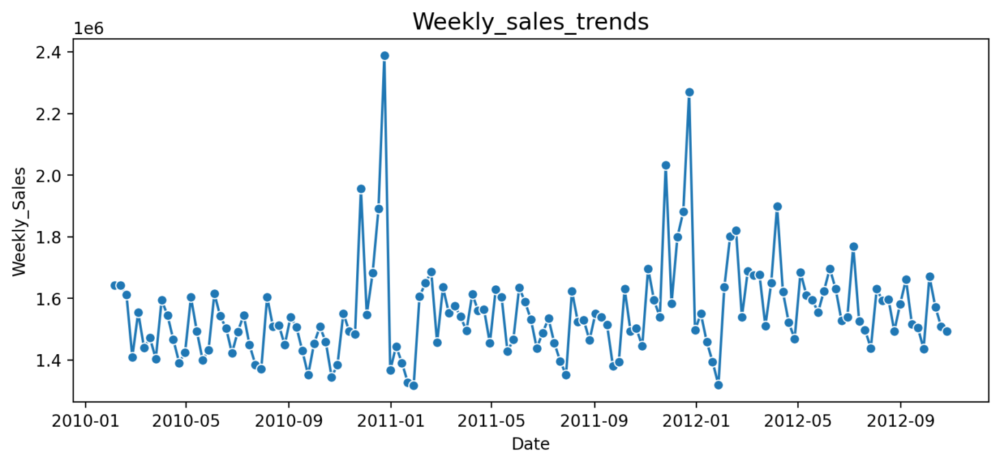
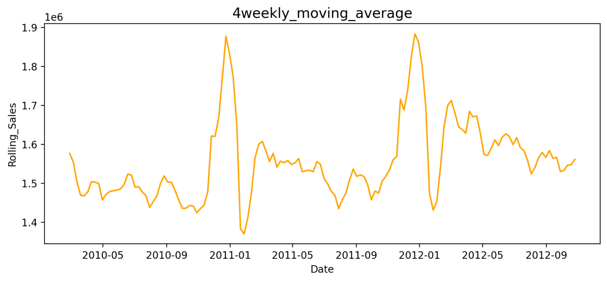

# Walmart売上可視化・予測ダッシュボード

## 概要

このプロジェクトは、Walmartの店舗別売上データを分析し、可視化と予測を行うためのインタラクティブなWebアプリケーションです。
Streamlitを使用しており、ユーザーは直感的な操作でデータのフィルタリングや分析が可能です。

## 主な機能

* **直感的なデータ探索:** 店舗(Store)や日付範囲(Date Range)を指定して、売上データを絞り込めます。
* **売上トレンドの可視化:**
    * 選択した店舗の売上トレンドを折れ線グラフで表示し、全体的な売り上げの波を把握。
    
    * 移動平均線をスライダーで調整し、短期的な変動を平滑化して中長期的な傾向を把握できます。
    
* **祝日の影響分析:** 祝日と通常週の平均売上を比較し、祝日が売上に与える影響を分析します。
    
* **SARIMAXモデルによる売上予測:**
    *   季節性と外部特徴量を考慮できる**SARIMAXモデル**を採用し、将来の売上を予測。
    
    * 気温、燃料価格、CPI、失業率を外部特徴量として**モデル**に組み込み、予測精度の向上を追求。
   * 予測モデルに用いる外部特徴量の影響度を、スライダーで直感的に調整し、様々なシナリオをシミュレーション可能。
    
## 使用データ

このアプリケーションでは、`Walmart_Sales.csv`のデータを使用します。 データには以下のカラムが含まれています。

* `Store`: 店舗ID
* `Date`: 日付
* `Weekly_Sales`: 週間売上
* `Holiday_Flag`: 祝日フラグ (1: 祝日, 0: 通常週)
* `Temperature`: 気温
* `Fuel_Price`: 燃料価格
* `CPI`: 消費者物価指数
* `Unemployment`: 失業率

## 技術スタック（使用した主なライブラリ）

| 分類 | ライブラリ | 目的 |
| :--- | :--- | :--- |
| データ操作・分析 | `pandas` | データフレーム操作、CSVファイルの読み込み、時系列データの処理 |
| データ可視化 | `matplotlib`, `seaborn` | グラフ描画（売上トレンド、移動平均線、予測結果など） |
| Webアプリケーション | `streamlit` | インタラクティブなダッシュボードの構築と表示 |
| 時系列予測モデル | `statsmodels` | SARIMAXモデルの構築、学習、予測 |


## 実行方法

1.  **リポジトリをクローン:**
    ```bash
    git clone [https://github.com/GAT252/walmart_dashboard]
    cd walmart_dashboard
    ```
2.  **必要なライブラリをインストール:**
    ```bash
    pip install -r requirements.txt
    ```
3.  **アプリケーションを実行:**
    ```bash
    streamlit run app.py
    ```
4.  ブラウザで `http://localhost:8501` を開きます。

## 工夫した点

### SARIMAXモデルと外部特徴量の活用
売上のような時系列データは、単純な統計量だけでは捉えきれない**季節性やトレンド**が存在します。そこで、これらの要素をモデルに組み込める`SARIMAX`を採用しました。

さらに、売上は店舗を取り巻く外部環境にも影響されると考え、気温(`Temperature`)、燃料価格(`Fuel_Price`)、消費者物価指数(`CPI`)、失業率(`Unemployment`)を**外部特徴量(Explanatory Variables)としてモデルに追加**しました。 これにより、単なる過去の売上パターンだけでなく、経済状況の変化なども考慮した、より現実に即した精度の高い予測を目指しました。

### ユーザーによるパラメータ調整機能
予測モデルのパラメータ（特に外部特徴量の影響度）をユーザーがスライダーで直感的に調整できるようにしました。 これにより、**「もし来月、燃料価格が2倍になったら売上はどうなるか？」**といった**What-If分析**を手軽に実行できます。分析者だけでなく、ビジネスサイドのユーザーにとってもわかりやすく、価値のある機能だと考えています。

### 過去の売り上げ予測の意味
現在より未来の売り上げ予測だけではなく過去の売り上げ予測も表示する意図は過去の売り上げ予測が実際の売り上げに近かった場合、未来に対する売り上げ予測が信頼できることが担保される。
## 今後の展望

* **他モデルとの精度比較:** `Prophet`や`LSTM`などの他の時系列予測モデルを実装し、予測精度を比較検証する。
* **特徴量エンジニアリングの深化:** 天候データや地域のイベント情報など、さらに多様な外部特徴量を追加し、予測精度の向上を図る。
* **外部特徴量の必要性:**外部特徴量を使用しない `SARIMA`と使用する `SARIMAX`を比較した場合 `SARMA`のほうが正確に売り上げを予測で来ていたから `SARIMAX`の必要性を検証する。